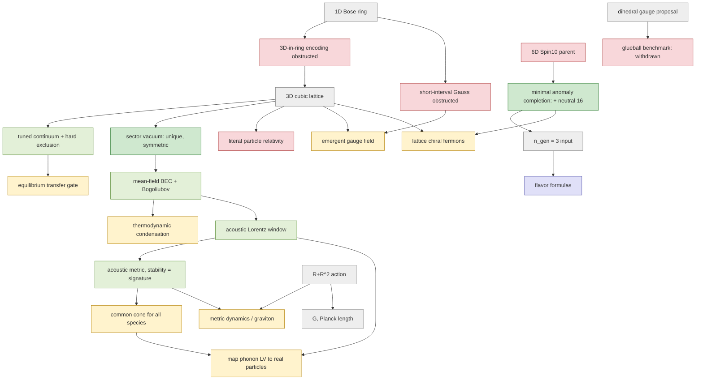

# Unification map: where the pieces connect and where they do not

2026-09-25. This is a whole-repository review of what a theory of everything
would need and what the repository actually supplies for each link. The
machine-readable version is [`unification_map_2026-09-25.json`](unification_map_2026-09-25.json),
and `tests/test_unification_map.py` checks its integrity. It is a dependency
map, not a completion score. **BPR is not a completed theory of everything, and
this review does not make it one.** It records two new links (sections 2–3) and
names the smallest well-posed problems that stand between the current state and
a connected theory (section 5).

## 1. The honest one-paragraph answer

Everything does not yet tie together. The repository contains four largely
separate islands:
1. **Bosonic substrates.** A 1D ring and a supplied 3D cubic lattice, with many
   exact finite-system theorems.
2. **A supplied gauge sector.** A dihedral finite group in 2D; its 1.0 particle
   predictions were falsified by a sealed glueball benchmark.
3. **A supplied six-dimensional chiral matter parent.** Until today it was
   excluded by an irreducible anomaly.
4. **Supplied gravity.** An R+R² action with calibrated G.

Flavor formulas sit on top as phenomenology, with fitted inputs and n_gen=3 as
an input. No derived map connects the substrate to the gauge, matter or gravity
islands. Nor is there an observation that distinguishes the substrate from
conventional Bose physics. This session adds:
- a controlled bridge from the 3D substrate to a condensed vacuum with a
  Lorentz-invariant (acoustic) low-energy sector;
- an anomaly-consistent completion of the matter parent.

Neither bridge crosses between islands.

## 2. New link A: substrate → vacuum → acoustic spacetime

[`cubic_condensate_regime_2026-09-25.md`](cubic_condensate_regime_2026-09-25.md)
works on the unchanged cubic lattice (C>0, g>=0). It proves:
- **Exact sector vacuum.** Every fixed-N ground state is unique, positive and
  invariant under all graph automorphisms.
- **Controlled condensation.** In the mean-field regime at fixed lattice size,
  depletion is bounded uniformly in N, and the low spectrum converges to
  Bogoliubov. The proof is self-contained.
- **Lorentz window.** The phonon's deviation from ω=c_s|q| is bounded exactly by
  max(a²/12, ξ²)|q|². This realizes the relativity gate's conditional acoustic
  Lagrangian, with A and B derived rather than assumed.
- **Acoustic metric.** For uniform flows, the long-wave cone is the null cone of
  an acoustic metric. It is Lorentzian iff the flow is dynamically stable, and
  it has no ergoregion iff the flow is long-wave Landau stable.

This is the first place in the repository where a microscopic model yields an
interacting vacuum with a Lorentz-invariant low-energy excitation under
controlled approximations. Its limits are just as concrete:
- one scalar species, so "common speed" is trivial;
- a preferred frame;
- anisotropic and superluminal corrections at order q²;
- no tensor dynamics, no photon, no fermions;
- no thermodynamic limit.

## 3. New link B: an anomaly-consistent matter target

[`chiral_parent_completion_2026-09-25.md`](chiral_parent_completion_2026-09-25.md)
shows that the smallest local completion is one added opposite-chirality
Spin(10) spinor with zero U(1)_F charge. It is the unique 16-component
completion, and nothing smaller works:

    16₊(Q=1) ⊕ 16₋(Q=0),    I8 = (1/3) X² (3S2 + 2X² − p1),

which one Green–Schwarz 2-form cancels. At flux 3 the massless four-dimensional
content is exactly three chiral 16's. These pass the Spin(10)³, Witten SU(2)
and Z16 checks. The remaining U(1)_F anomalies are all proportional to X4 and
are cancelled by the descended axion, which makes U(1)_F massive.

An independent review caught that the first version had excluded neutral
spinors without justification and so reported a larger 36-component
completion. That result is kept as a narrower-class classification.

Open problems: the added spinor and 2-form are inputs, Ω7 bordism and 2-form
quantization are unchecked, flux 3 is chosen, and no substrate realization
exists.

## 4. The dependency graph

Colors: green = proved (exact or controlled), yellow = open, red = obstructed
or withdrawn, grey = supplied, blue = fit. The JSON gives sources and
limitations for every node.

## 5. Critical path: the smallest problems that would connect the islands

These are ordered by how many open nodes each would unblock. Each has a
concrete first calculation; none is authorized as physics by this map alone.

1. **Common limiting speed (spacetime).** Add a second boson species to the
   cubic lattice: a two-component Bose–Hubbard model with g11, g22, g12. At
   Bogoliubov level, with equal hopping, there are two phonon branches with
   c_i²=2κλ_i(G), where G=[[g11ν1, g12√(ν1ν2)],[g12√(ν1ν2), g22ν2]]. This is
   the standard two-component result, recorded here rather than rederived. A
   single cone needs G∝I, i.e. g12=0 and g11ν1=g22ν2, a codimension-two tuning.
   No symmetry of the model protects it:
   - the inter-species density coupling n1n2 is allowed by U(1)×U(1)×Z2;
   - making the couplings SU(2)-symmetric (g11=g22=g12) makes the spin mode
     quadratic, a type-B Goldstone mode, rather than giving it the same cone.

   **In this substrate class, a universal light cone is therefore not natural
   at leading order.** This is a structural reason for caution about "emergent
   Lorentz invariance" claims. It matches the bimetricity known from analogue
   gravity. Next calculation: control the two-component mean-field limit as in
   Theorem 4 of the condensate note. Then find a mechanism that forces all
   low-energy fields to share one cone, for example all of them being
   excitations of a single order parameter, or a Chadha–Nielsen-type
   renormalization-group flow in a gauge theory. If no such mechanism exists
   for a substrate, that substrate cannot underlie relativistic multi-field
   physics.
2. **Emergent gauge field (gauge).** The ring theorem excludes exact bounded
   short-interval Gauss operators on unrestricted Fock space. The known escape
   is energetic: bosons on links with a large vertex-charging term, whose
   low-energy sector is a compact U(1) lattice gauge theory with a photon (the
   quantum-ice mechanism). First calculation: the degenerate-perturbation
   ring-exchange coefficient for link bosons on the cubic lattice, and the
   stability of its Coulomb phase. This changes the substrate's degrees of
   freedom and requires explicit approval as a new model.
3. **Chiral matter on the substrate (matter).** The completion supplies
   three chiral 16's, 16 Weyl fermions per generation, with Z16 count zero.
   Any lattice realization must evade
   Nielsen–Ninomiya doubling. Possible routes are domain walls, or gapping a
   mirror sector by symmetric mass generation, for which sixteen Weyl fermions
   per generation is the content usually required. First calculation: the
   free-fermion doubling count for the proposed lattice embedding, then the
   mirror-sector interaction needed to gap it.
4. **Metric dynamics (gravity).** The acoustic metric obeys hydrodynamics, not
   Einstein's equations. Any emergent massless spin-2 state must evade
   Weinberg–Witten, typically through non-fundamental Lorentz symmetry or
   diffeomorphism as a gauge redundancy. First calculation: the induced
   (Sakharov) Einstein–Hilbert coefficient from the phonon loop on a slowly
   varying acoustic background. Compare it with the hydrodynamic back-reaction
   to show which dominates.
5. **Thermodynamic vacuum (vacuum).** Extend condensation beyond the mean-field
   regime at fixed size. Rigorous results exist in the literature only for
   hard-core bosons at half filling. First calculation: state precisely which
   reflection-positivity / infrared-bound results transfer to the g→∞ member of
   the family.
6. **Flux and family number (matter/flavor).** q=3 is chosen, and the flux
   energy alone favors q=0 at fixed radius (constructive extension note,
   chiral section). First calculation:
   the moduli potential including the Green–Schwarz term and Casimir energies.
   It is possible that no minimum selects q=3; that outcome should be recorded
   if found.

## 6. Recorded legacy debt found in this review

Found by read-only surveys and not repaired here. These are recorded so that
they are not mistaken for results.

- Gravity/cosmology:
  - `bpr/black_hole.py` still uses the pre-audit spacing a=l_P·sqrt(p/48π²),
    and `tests/test_extended_predictions.py` asserts it.
  - `bpr/bridges/cosmology_gravity.py` (and `bridges/substrate_quantum.py`)
    use the superseded a=l_P/√p.
  - `dark_energy_from_boundary_action` describes Ω_Λ≈0.69 but returns ~1e-104.
  - `planck_to_hubble` reads a nonexistent attribute, swallows the exception
    and returns the input H0.
  - `cosmology.py` uses slow-roll ε=3/(2N²) and a hard-coded A_s;
    `gravity_consistency` uses 3/(4N²).
  - `emergent_spacetime.py` hard-codes 3+1 dimensions and signature.
  - Three mutually inconsistent gravitational-wave dispersion statements
    coexist.
- Particle side:
  - `DERIVATION_ROADMAP.md` and parts of `VALIDATION_STATUS.md` still carry
    pre-audit "DERIVED" labels.
  - m_τ is described four inconsistent ways.
  - `koide_predicted` returns 2/3 although the model gives 0.6653.
  - `strong_cp_theta` returns 0 for every odd prime.
  - `clifford_bpr.e8_to_sm_decomposition` keeps a withdrawn decomposition.
  - `topological_anomaly_inflow` uses an incorrect b₃ and a family cap.
  - The example hypercharges in the `boundary_action.anomaly_inflow` docstring
    have nonzero Tr Q³.
  - Path B documents still describe the substrate as "deconfined", whereas the
    code now reports an unknown phase.
- Tests: `tests/test_substrate_triplet_projection.py::test_mixed_scale_cubic_underflow_is_not_reported_as_closure`
  fails on x86-64 Linux. There `np.longdouble` is 80-bit extended, so the
  expected underflow does not occur; the test assumes a platform where
  longdouble equals double. The full suite on this platform gives 7,388
  passed, 4 skipped, 1 failed, before the new modules.

## 7. What would count as "everything ties together"

At minimum there must be one microscopic Hamiltonian whose controlled
low-energy limit contains, from the same degrees of freedom:
- a single light cone shared by all propagating fields;
- gauge fields with the Standard Model group;
- anomaly-free chiral matter with three families not put in by hand;
- a dynamical metric with universal coupling.

It must also yield at least one prediction that differs from conventional
physics and survives a preregistered test. Today:
- the first and fourth are open;
- the third has a consistent target but no substrate realization;
- the second has no route beyond a supplied 2D proposal;
- the prediction requirement is unmet.

The critical path in section 5 is the most direct honest route.
